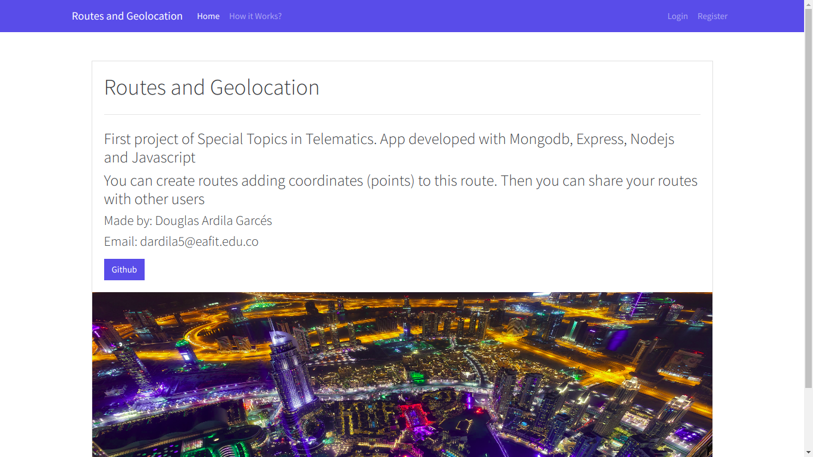
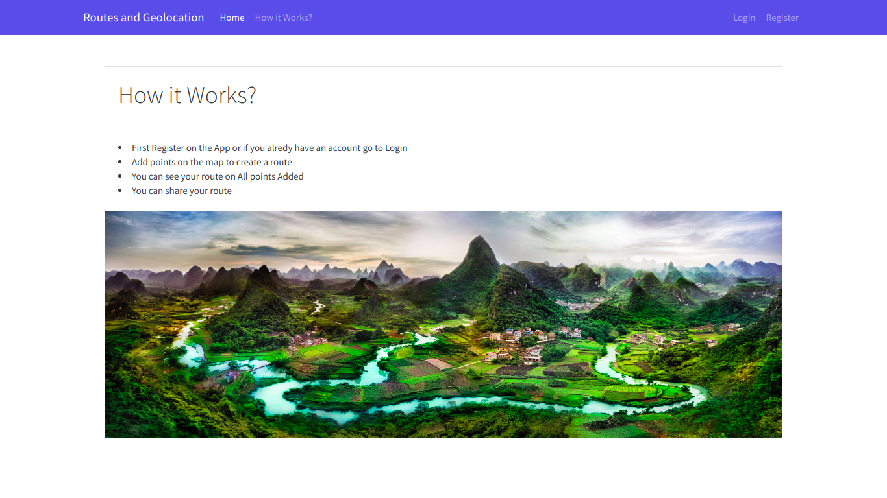
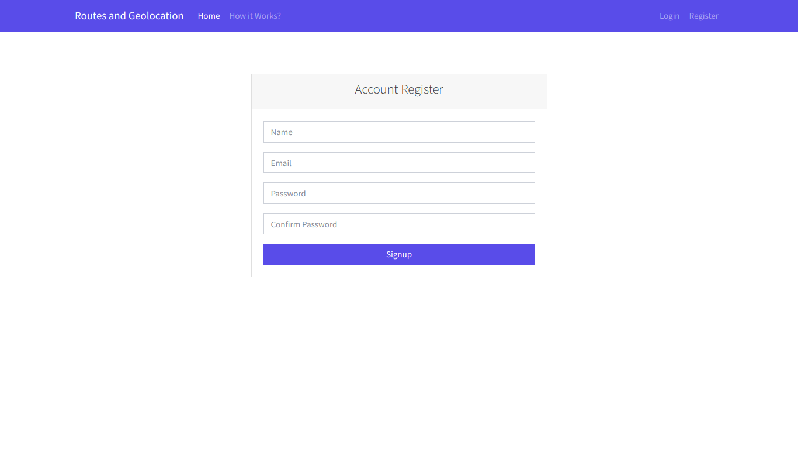
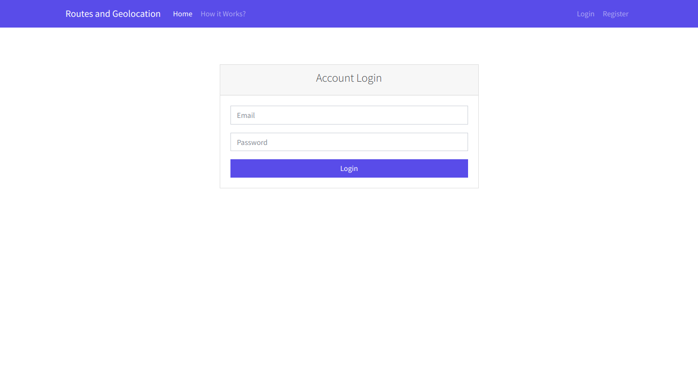
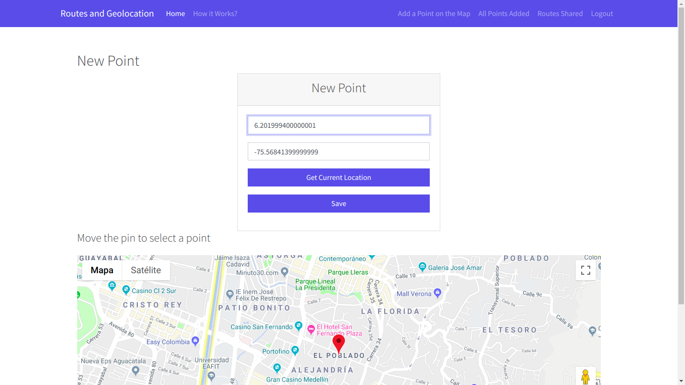
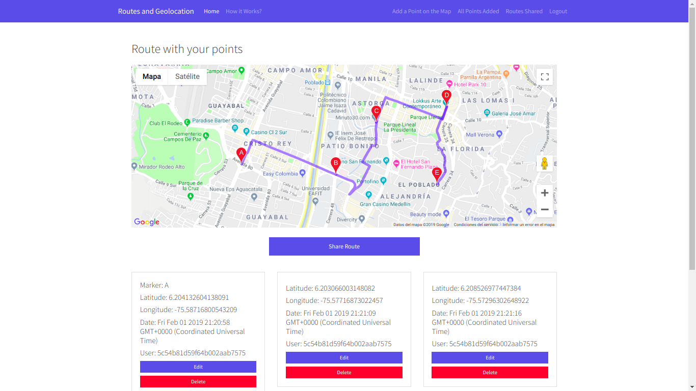
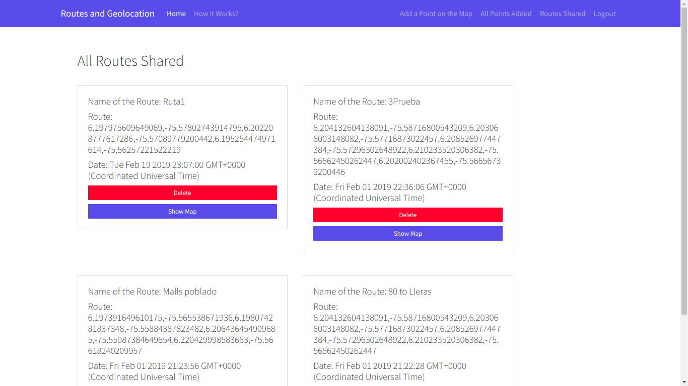
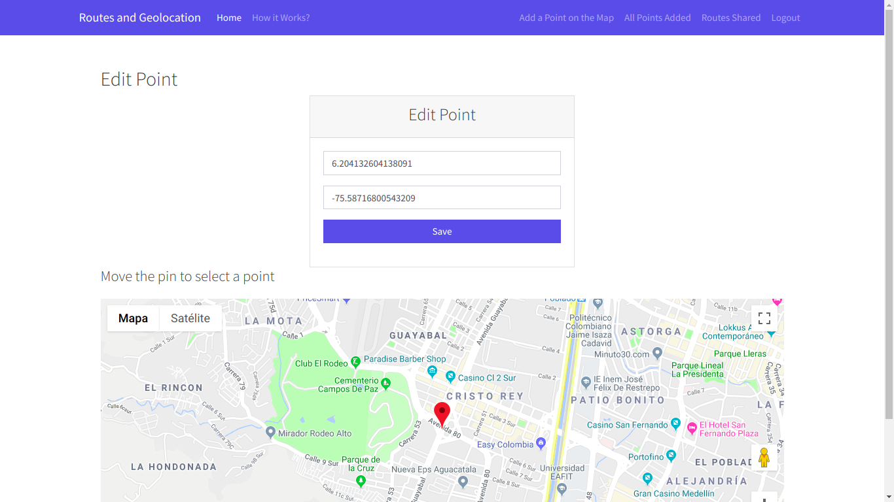

# TET-Project1
Materia: Topicos Especiales en Telemática

Por: Douglas Ardila Garces

Email: dardila5@eafit.edu.co

1. Descripción de aplicación:

    Primer proyecto de Topicos Especiales en Telemática. 
    
    Aplicación desarrollada con Mongodb, Express, Nodejs, Javascript, Api Google Maps para Javascript
    Cada usuario puede crear, editar y borrar rutas agregando coordenadas (puntos) a esta ruta. Luego podrás compartir tus rutas con otros usuarios.
    
2. Instrucciones de uso:
    
    Para instalar modulos de Nodejs usados:
    
        npm install
    Para iniciar la applicacion en el localhost:3000
    
        npm start
    Para instalar mongodb siga esta guia de acuerdo a su sistema operativo
    
        https://docs.mongodb.com/manual/installation/
    
3. Modelo de datos
    
        User:
        {
            name: String,
            email: String,
            password: String,
            date: Date
        }

        Point:
        {
            latitude: String,
            longitude: String,
            date: Date,
            user: String
        }

        Route:
        {
            name: String,
            route: String,
            date: Date
        }

4. Servicios Web

        /* Servicio Web: Menu raiz de la aplicación
           Método: GET
           URI: /
        */

        /* Servicio Web: Informacion adicional sobre la aplicación
           Método: GET
           URI: /about
        */

        /* Servicio Web: Formulario de registro de usuarios
           Método: GET
           URI: /users/signup
        */
        
        /* Servicio Web: Almacena y verifica el usuario creado
           Método: POST
           URI: /users/signup
        */
        
        /* Servicio Web: Formulario para inicio de sesión de usuarios
           Método: GET
           URI: /users/signin
        */
        
        /* Servicio Web: Verifica el usuario ingresado y posteriormente muestra el menu de la aplicacion
           Método: POST
           URI: /users/signin
        */
        
        /* Servicio Web: Cierre de sesion
           Método: GET
           URI: /users/logout
        */
        
        /* Servicio Web: Vista para agregar un nuevo punto en un mapa
           Método: GET
           URI: /points/add
        */
        
        /* Servicio Web: Agregar un nuevo punto
           Método: POST
           URI: /points/new-point
        */
        
        /* Servicio Web: Ver todos los puntos agregados
           Método: GET
           URI: /points
        */
        
        /* Servicio Web: Editar un punto en especifico
           Método: GET
           URI: /points/edit/:id
        */
        
        /* Servicio Web: Actualizar un punto en especifico
           Método: PUT
           URI: /points/edit-point/:id
        */
        
        /* Servicio Web: Borrar un punto en especifico
           Método: DELETE
           URI: /points/delete/:id
        */
        
        /* Servicio Web: Compartir una ruta en especifico
           Método: POST
           URI: /points/new-route
        */
        
        /* Servicio Web: Ver rutas compartidas
           Método: GET
           URI: /routes
        */
        
        /* Servicio Web: Borrar una ruta
           Método: DELETE
           URI: /route/delete/:id
        */
        
        /* Servicio Web: Mostar mapa con la ruta seleccionada
           Método: GET
           URI: '/map/:id
        */
        
5. Despliegue (DCA y nube IaaS de AWS) con docker
    
    DCA
        
        https://dardila5.dis.eafit.edu.co/
    Nube IaaS de AWS
        
        https://ec2-18-206-35-89.compute-1.amazonaws.com/ 
        
6. Screenshots

